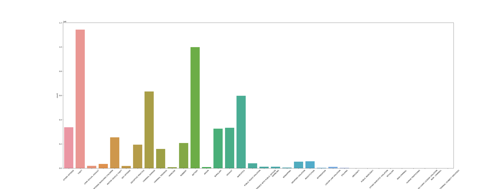
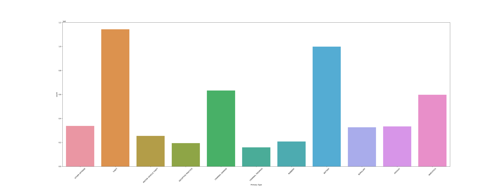
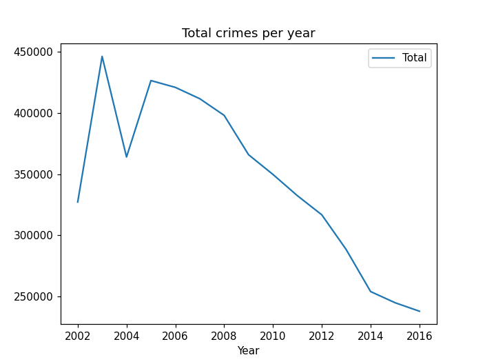
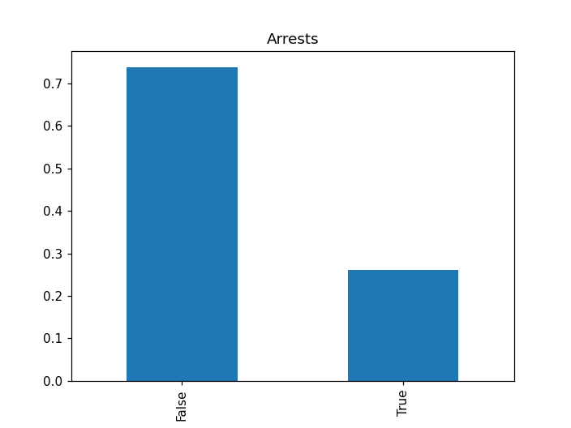
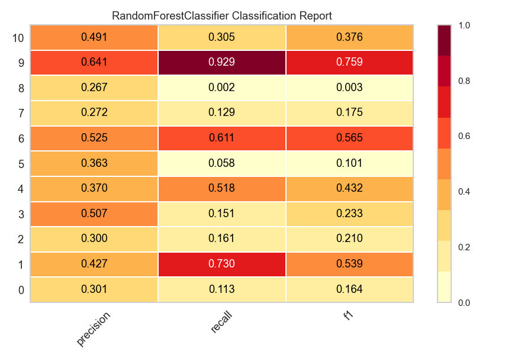
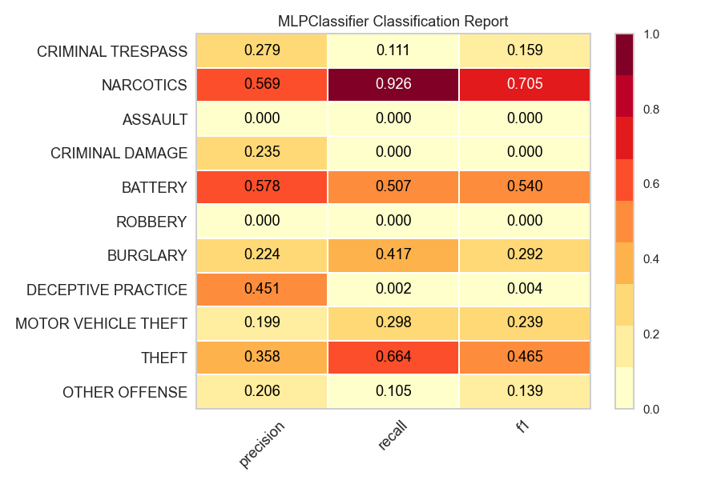
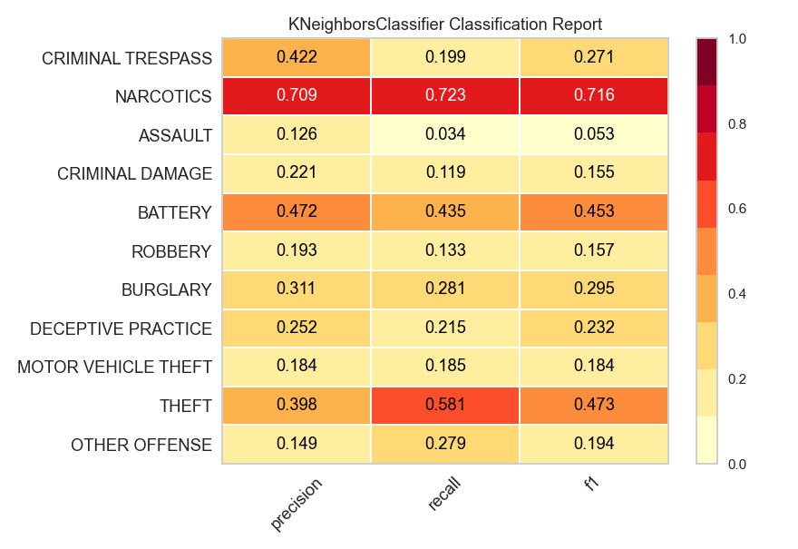
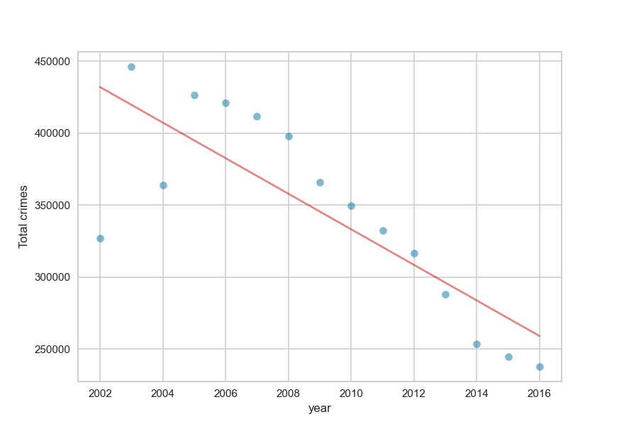

# Practica3-Apc-Kaggle
Tercera pràctica de l'assignatura d'aprenentatge computacional on es treballarà amb el kaggle de Crimes in Chicago.

### NOM: Adrián Nieto Núñez
### NIU: 1569312
### DATASET: Crimes in Chicago
### URL AL KAGGLE: https://www.kaggle.com/datasets/currie32/crimes-in-chicago

## INTRODUCCIÓ AL KAGGLE
El dataset recull les dades obtingudes a partir dels crims comesos a Chicago durant un període de 2001 a 2017.
Compta amb aproximadament uns **8 milions de files amb 23 atributs(columnes)**, que fan referència al tipus de crim,quan es va cometre, la seva ubicació aproximada, si qui va cometre el crim va se arrestada o no, entre d'altres.

### Objectius del dataset
L'objectiu proposat per aquest dataset és tractar de **predir el tipus de crim** en base a factors com el barri, si n'hi va haver arrest o si el crim va ser a un domicili on en altre lloc, etc.
També es proposa tractar de fer una predicció del total de crims per un any en concret.

***

### Preprocessing
Primerament, com tenim el dataset dividit en 4 arxius .csv degut al seu tamany, els concatenem en un sol dataframe de la llibrería de pandas per tal de tractar-lo.
El dataset sencer en té **796.069 valors nuls**, i per tant els esborrem ja que per el volum de dades que tenim tampoc suposa una gran pèrdua.

Eliminar aquests valors nuls suposa un **10,24%** del total del dataset.

A continuació es mira si n'hi han valors repetits en el dataset resultant fins ara amb els camps d'ID i Case Number, que són atributs que no s'haurian de repetir en cap circumstància i trobem que n'hi han **1.666.884 valors duplicats** i els eliminem. Eliminant duplicats i nuls hem eliminat un **31,014% de dades** del dataset inicial.

També haurem de passar els atributs categòrics (la majoria) a NO categòrics per tal de poder operar amb ells.
Un exemple per passar el atribut **_DATE_** a tipus datetime és el següent:
~~~
crimeC['Date'] = pd.to_datetime(crimeC['Date'], format='%m/%d/%Y %I:%M:%S %p')
~~~

***

### Visualització de les dades
En aquest apartat es mostren uns petits exemples de visualització d'algunes dades interessants del dataset.

#### Exemple d'un countplot de seaborn per mostrar la quantitat de cada tipus de crim:

En aquest cas decideixo eliminar els tipus de crims que tinguin una ocurrència menor a 100.000, ja que crec que no hi estaria massa balancejat i hauria més disparitat a les dades.

<table>
  <tr>
    <th>Crime</th>
    <th>Ocurrence</th>
  </tr>
  <tr>
    <td>HUMAN TRAFFICKING</td>
    <td>20</td>
  </tr>
  <tr>
    <td>KIDNAPPING</td>
    <td>5022</td>
  </tr>
  <tr>
    <td>NON-CRIMINAL	</td>
    <td>80</td>
  </tr>
  <tr>
    <td>NON-CRIMINAL (SUBJECT SPECIFIED)	</td>
    <td>4</td>
  </tr>
  <tr>
    <td>CRIM SEXUAL ASSAULT</td>
    <td>20166</td>
  </tr>
  <tr>
    <td>INTIMIDATION</td>
    <td>3171</td>
  </tr>
  <tr>
    <td>RITUALISM</td>
    <td>13</td>
  </tr>
  <tr>
    <td>ASSAULT</td>
    <td>334045</td>
  </tr>
  <tr>
    <td>NARCOTICS</td>
    <td>597701</td>
  </tr>
  <tr>
    <td>ARSON</td>
    <td>8863</td>
  </tr>
  <tr>
    <td>BATTERY</td>
    <td>998674</td>
  </tr>
  <tr>
    <td>CRIMINAL TRESPASS	</td>
    <td>159349</td>
  </tr>
  <tr>
    <td>OBSCENITY</td>
    <td>363</td>
  </tr>
  <tr>
    <td>NON - CRIMINAL</td>
    <td>38</td>
  </tr>
  <tr>
    <td>PROSTITUTION</td>
    <td>56985</td>
  </tr>
  <tr>
    <td>LIQUOR LAW VIOLATION	</td>
    <td>11291</td>
  </tr>
  <tr>
    <td>CONCEALED CARRY LICENSE VIOLATION</td>
    <td>84</td>
  </tr>
  <tr>
    <td>PUBLIC INDECENCY</td>
    <td>124</td>
  </tr>
  <tr>
    <td>MOTOR VEHICLE THEFT</td>
    <td>254388</td>
  </tr>
  <tr>
    <td>OTHER OFFENSE</td>
    <td>337754</td>
  </tr>
  <tr>
    <td>BURGLARY</td>
    <td>326234</td>
  </tr>
  <tr>
    <td>OTHER NARCOTIC VIOLATION</td>
    <td>101</td>
  </tr>
  <tr>
    <td>OFFENSE INVOLVING CHILDREN	</td>
    <td>35484</td>
  </tr>
  <tr>
    <td>STALKING</td>
    <td>2626</td>
  </tr>
  <tr>
    <td>INTERFERENCE WITH PUBLIC OFFICER</td>
    <td>12250</td>
  </tr>
  <tr>
    <td>THEFT</td>
    <td>1143153</td>
  </tr>
  <tr>
    <td>WEAPONS VIOLATION</td>
    <td>54516</td>
  </tr>
  <tr>
    <td>HOMICIDE</td>
    <td>7812</td>
  </tr>
  <tr>
    <td>DECEPTIVE PRACTICE	</td>
    <td>194091</td>
  </tr>
  <tr>
    <td>GAMBLING</td>
    <td>12669</td>
  </tr>
  <tr>
    <td>SEX OFFENSE	</td>
    <td>18975</td>
  </tr>
  <tr>
    <td>CRIMINAL DAMAGE</td>
    <td>633246</td>
  </tr>
  <tr>
    <td>PUBLIC PEACE VIOLATION</td>
    <td>41041</td>
  </tr>
  <tr>
    <td>ROBBERY</td>
    <td>207996</td>
  </tr>
</table>

De tal forma que el countplot quedaria de la següent manera:

  

#### Exemple de plot on es mostren el total de crims per any:

~~~
plt = totalCrimesYear.plot(x = 'Year', y = 'Total', title='Total crimes per year')
~~~

#### Exemple de barplot per veure la proporció d'arrestos que es porten a terme contra els que no:

~~~
plt.figure()
crimeC['Arrest'].value_counts(normalize=True).plot.bar()
plt.title("Arrests")
plt.show()
~~~

***
  
### Models utilitzats
Per tal de tractar de complir amb els objectius de la pràctica s'han fet servir els següents models:

#### Random Forest Classifier

<table>
  <tr>
    <th>Accuracy</th>
    <th>Recall</th>
    <th>Precision</th>
    <th>F1-Score</th>
  </tr>
  <tr>
    <td>0.465954052390846</td>
    <td>0.465954052390846</td>
    <td>0.4256476188423885</td>
    <td>0.465954052390846</td>
  </tr>
</table>

***

#### Multi-Layer Perceptron Classifier

<table>
  <tr>
    <th>Accuracy</th>
    <th>Recall</th>
    <th>Precision</th>
    <th>F1-Score</th>
  </tr>
  <tr>
    <td>0.40121206158499767</td>
    <td>0.40121206158499767</td>
    <td>0.3469411857989667</td>
    <td>0.40121206158499767</td>
  </tr>
</table>

***

#### KNN Classifier

<table>
  <tr>
    <th>Accuracy</th>
    <th>Recall</th>
    <th>Precision</th>
    <th>F1-Score</th>
  </tr>
  <tr>
    <td>0.3758075748544002</td>
    <td>0.3758075748544002</td>
    <td>0.3638402094129815</td>
    <td>0.3758075748544002</td>
  </tr>
</table>

 
 ***
 
 #### Linear Regression
 Tractar de predir el total de crims per un any:
 MSE: 1491641528.5362532
 R^2: 0.47585501834335653
 var: 4337498268.0622225 
 
 
 La predicció de crims totals per l'any 2020 ha estat de **209761.279.**
 En 2020 va haver-hi uns 212k de crims a Chicago, per tant, fa una bona estimació, encara que no deixa de ser un model bastant simple i que anirà estimant cada cop menys crims en anys més allunyats degut a la tendència a la baixa.
 
 ***
 
 ### Conclusions
 Concluïm que Random Forest és el model que millor classifica i en menor temps en comparació a la xarxa neuronal.
 Y per les prediccions de crims total per any fa una bona estimació però com s'ha comentat abans faltarien dades que trenquesin aquesta tendència per millorar la predicció.
 
 ***
 
 ### Treball a futur
 Per un futur estaria bé ampliar les dades per tractar de solventar el problemes que es veuen en la regressió. També seria interesant provar altres models.
 Per altra banda seria interessant mostrar en un mapa de Chicago on s'han produit cada tipus de crim.
 
 
